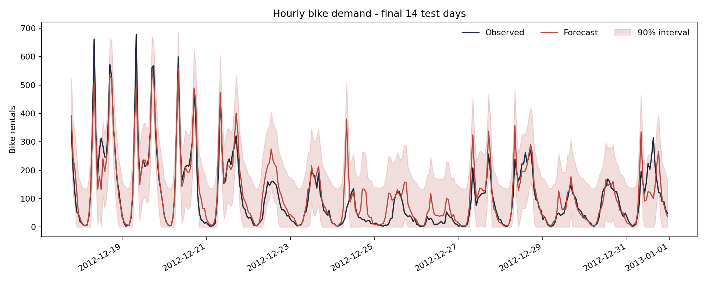

# Probabilistic Bike Demand Forecasting

An end-to-end machine-learning project for hourly bike-demand forecasting. The project is designed to demonstrate the skills expected in a strong ML internship application: temporal validation, leakage-safe features, robust baselines, nonlinear models, uncertainty quantification, interpretability, testing, and a small interactive application.

## Why this project is credible

- The split is chronological: train, calibration, then test.
- Target lags are matched to exact timestamps (`t-24h` and `t-168h`), so missing hours cannot silently misalign the history.
- The 24-hour rolling feature uses the half-open window `[t-24h, t)`, excluding the current target.
- A seasonal-naive baseline is evaluated alongside the ML model.
- The point model uses a Poisson loss suited to non-negative count data.
- Prediction intervals are calibrated on a held-out time window using split conformal prediction.
- Metrics include MAE, RMSE, RMSLE, interval coverage and interval width.
- Permutation importance is computed only on the untouched test period.

## Verified holdout results

The checked-in artifacts were produced from the real UCI hourly dataset. The final chronological test window runs from 8 August to 31 December 2012.

| Model | MAE | RMSE | RMSLE |
| --- | ---: | ---: | ---: |
| Seasonal naive (`t-168h`) | 63.95 | 109.62 | 0.586 |
| Poisson histogram gradient boosting | **48.65** | **79.98** | **0.364** |

Compared with the weekly baseline, the model reduces MAE by 23.9%, RMSE by 27.0% and RMSLE by 37.8%. The nominal 90% conformal interval reaches 89.8% coverage on the shifted test period, with a mean width of 229.95 rentals.



## Quick start

```bash
python -m venv .venv
source .venv/bin/activate  # Windows: .venv\Scripts\activate
pip install -e ".[app]"
python -m bikeshare_forecast.train --output-dir artifacts --data-path data/uci/hour.csv
```

The repository includes the official UCI Capital Bikeshare hourly data (17,379 observations from 2011-2012). The loader explicitly excludes `casual` and `registered`, because they are components of the target `cnt` and would cause direct target leakage.

An autonomous demo mode is also available. It generates a reproducible two-year hourly series with trend, annual and weekly seasonality, commuting peaks, weather effects, holidays, autocorrelation and rare demand shocks:

```bash
python -m bikeshare_forecast.train --output-dir artifacts_demo --data-path ""
```

Launch the dashboard after training:

```bash
streamlit run app.py
```

Run the tests:

```bash
PYTHONPATH=src python -m unittest discover -s tests -v
```

## Real-data extension

The included dataset is loaded through the schema adapter in `data.py`. The normalized UCI weather variables are converted back to their documented physical scales. Time-series observations are never randomly shuffled. The raw UCI series contains missing hours, so lag features are joined by timestamp rather than computed with positional row shifts. Rows without the required exact history are excluded before splitting.

Dataset reference: Fanaee-T, H. and Gama, J. (2014), *Bike Sharing*, UCI Machine Learning Repository.

## Repository structure

```text
.
├── app.py
├── pyproject.toml
├── requirements.txt
├── src/bikeshare_forecast/
│   ├── data.py
│   ├── evaluation.py
│   ├── features.py
│   ├── modeling.py
│   └── train.py
└── tests/
    ├── test_features.py
    └── test_pipeline.py
```

The test suite checks chronological splitting, end-to-end artifact generation, leakage-safe rolling windows, and exact lag alignment on an intentionally irregular time series.

## Sources

- UCI Bike Sharing dataset: https://archive.ics.uci.edu/dataset/275/bike+sharing+dataset
- scikit-learn time-series cross-validation: https://scikit-learn.org/stable/modules/generated/sklearn.model_selection.TimeSeriesSplit.html
- scikit-learn gradient boosting prediction intervals: https://scikit-learn.org/stable/auto_examples/ensemble/plot_gradient_boosting_quantile.html
- scikit-learn permutation importance: https://scikit-learn.org/stable/modules/permutation_importance.html
